# ご当地グルメマップを作ろう  

# Lets create Local Food Map

### PyCon APAC 2023 Day2

Hiroshi Sano / 佐野浩士


---

## Agenda

* トークのモチベーション
* 情報を集めよう: どの情報を使うか
* マップデータを作ろう: 情報収集をアウトプット
* 利用先を考えよう: サービスと連携しよう

---

## 今回の資料

付録含めてすでに公開されています。

* GitHubリポジトリ: Starくれー！
  <https://github.com/hrsano645/pyconapac2023-local-food-map>

* このslide
  <https://github.com/hrsano645/pyconapac2023-local-food-map/slide/slide.me>

あとでトライしたい方は参考にしてね

---

## Self Infroduction

Hiroshi Sano(佐野浩士) [@hrs_sano645](https://twitter.com/hrs_sano645)

* 🏢: [株式会社佐野設計事務所](https://sano-design.info) CEO
* 🐍: PyCon mini Shizuoka Stuff
  * Shizuoka.py / Unagi.py / PythonSuruga
* CivicTech, [Startup Weekend Oganizatior](https://swfuji.doorkeeper.jp)
* Hobby: Camp🏕️,DIY⚒️,IoT💡

<!-- ここに画像をいくつか並べる PyCon shizu , DIY, CAMPとか 200x200で-->

  

---

## 弊社紹介

< 一枚絵の画像で、やっていることを紹介する >

<!-- 

* 弊社佐野設計事務所は機械設計を行う事務所です。主に自動車プラス金型を扱います。
* 3D CADを扱いモデリングを行い、製品の3Dモデリングも請け負ってます。
* 弊社では様々な業務の効率化をPythonやクラウドサービスを組み合わせて、実現しています。

-->

---

## トークのモチベーション

* ご当地のグルメの**情報収集してマップを作り**ましょう！食べに行きましょう！
* PyCampを終えた人向け: **Pythonでデータを集めて作り利用するプロセス**
  を学べます

---

## PyCampとは

* Python Boot Camp
* 日本全国で開催されているPythonの学習プログラム
* 半日をかけて、Pythonの基礎からプログラムを作る
  * 地元静岡県だと3回開催

<!-- ここに3枚の静岡開催の写真を載せる -->
  

このトークはその続きからトライできるコンテンツを目指して作りました

---

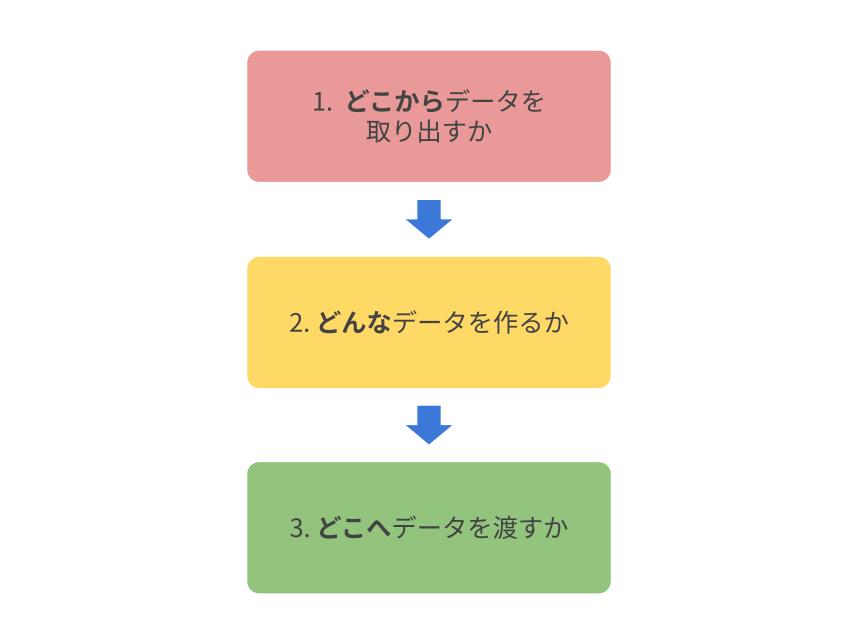

PyCampの次にトライできるテーマとして

* データを読む/取り込む
* データを加工/出力する
* データを使う/活用する

3つの流れで、ご当地グルメマップを作ります

---

## ご当地グルメ？

* 旅行がしやすくなった昨今
* 観光地でご飯食べようにも色々悩む
  * 情報サイトは有名なものだらけ。美味しいところは他にもある
* 公開されている情報をもとにマップを作って旅行計画するのはいかがでしょう？

いわゆるB級グルメを食べましょう🤤

---

## 今回のお題

---

## 富士宮焼きそば


<!-- _footer: しんかわな, CC BY 3.0 <https://creativecommons.org/licenses/by/3.0>, ウィキメディア・コモンズ経由 -->

---

* 主に静岡の富士宮市周辺で食べられる焼きそば
* B級グルメグランプリは殿堂入り
* 麺は富士宮周辺でしか手に入らないのでまさにローカルフード
  * （通販もあるけどね）

---

家庭料理でもある

 

<!-- _footer: 多分月に数回は食べてる -->

---

ところで、みなさん

---

もう食べたくなったでしょ？🤤

---

富士宮焼きそばマップを作りましょう！

---

## 今回のトークで目指すこと


* データを読む/取り込む
* データを加工/出力する
* データを使う/活用する

↓

* お店情報を探してWEBスクレイピング
* データを整形 -> CSVファイルにする
* Googleマイマップで呼び出す

---

## ご当地グルメの情報はどこにあるか

* 地域の情報を収集
* そこの情報は機械可読性があるか

---

## 観光情報を見てみる

* 市役所
* 観光協会
* ご当地グルメの公式サイト（よく〇〇学会とも言われる）

---

富士宮焼きそば学会 公式サイトを例にします。

<https://umya-yakisoba.com/>

<!-- _footer: 富士宮焼きそば学会の公式サイトを見せます -->

---

## データを読む/取得する


* **Webスクレイピングで収集する**
* [付録]画像識別で加工を試みる

<br>

機械可読性はどちらも微妙
WEBスクレイピングはまだやりやすい

---

## WEBスクレイピングの注意点

**※ただし、多数のアクセスはしないように注意**

* 単純に迷惑かけがち
* トラブルになりがち
* 試すときは少し時間を置きながらアクセスしましょう
  * ランダム時間置いてみるとか
  * 回数リミットをつけて待つようにする
  * サイトポリシーがあれば従う

---

## 利用するライブラリ

* requests: HTTPアクセス→情報取得（今回はHTML）
* Beautiful Soup4: HTML（マークアップ言語）解析と抽出

```bash
pip install requests beautifulesoup4
```

※:スライドではコードは説明用で動かない可能性があります。
資料から動作するスクリプトをDL可能です。

---

サイトの構造を見てみましょう

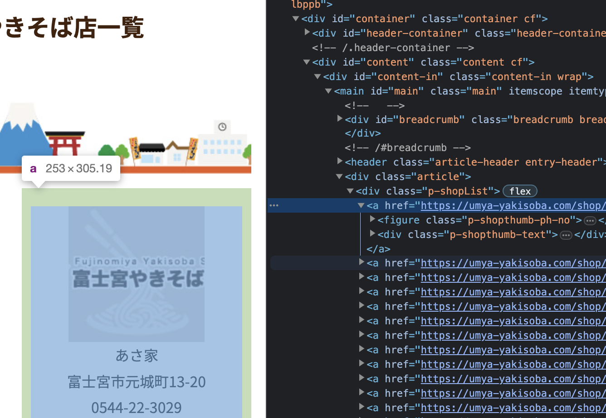

---

<!-- （構造で取りたい情報をマッピング） -->

この構造からbeautifulesoup4を使って必要な情報を取り出します。

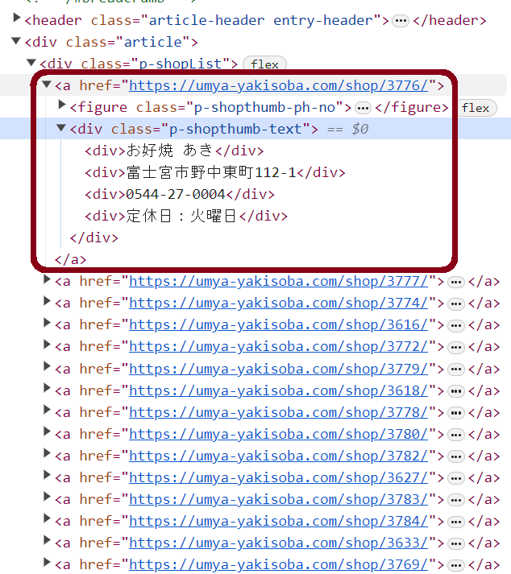

---

構造の中にあるタグから必要な情報を取得する

```python
import requests
from bs4 import BeautifulSoup

shopinfo_list = []
res = requests.get(url)
soup = BeautifulSoup(res.text, 'html.parser')


# ここではdiv.p-shopList > a にURLとその中にお店情報がまとまっているので、aタグから取り出す
shopinfo_tags = soup.find('div', class_='p-shopList').find_all("a")
```

---

<!-- 画像:  -->

aタグの下にあるそれぞれのタグから情報取得

```python

for shopinfo_tag in shopinfo_tags:
    shopdata = {}
    # aタグの子要素となるdivは上から店名、住所、電話番号、定休日。
    # ここではurlと店名だけまとめたリストを作る
    shopdata['specurl'] = shopinfo_tag.get('href')
    shopdata['店名'] = shopinfo_tag.find_all("div")[1].text
    shopinfo_list.append(shopdata)

```

---

取得結果

```
>>> shopinfo_list
[{'specurl': 'https://umya-yakisoba.com/shop/3776/', '店名': 'お好焼\u3000あき'},
{'specurl': 'https://umya-yakisoba.com/shop/3777/', '店名': 'あさ家'},
{'specurl': 'https://umya-yakisoba.com/shop/3774/', '店名': 'あるばとろす'}, 
{'specurl': 'https://umya-yakisoba.com/shop/3616/', '店名': 'いっぷく亭'}, 
{'specurl': 'https://umya-yakisoba.com/shop/3772/', '店名': 'お好み食堂 伊東'}, 
...
]
```

---

店名にある空白などを取り除きます

```python
def replace_str(text: str) -> str:
  
    replace_str_map = {
        # 置き換えたい
        "\u3000": " ",
    }
    replaced_text = text
    for key,val in replace_str_map.items():
        replaced_text = replaced_text.replace(key,val)
    return replaced_text
```

↓

---

```python

for shopinfo_tag in shopinfo_tags:
    shopdata = {}
    # divは上から店名、住所、電話番号、定休日。
    # ここではurlと店名だけまとめたリストを作る
    shopdata['specurl'] = shopinfo_tag.get('href')
    shopdata['店名'] = replace_str(shopinfo_tag.find_all("div")[1].text)
    
    shopinfo_list.append(shopdata)

```

↓

```
>>> shopinfo_list
[{'specurl': 'https://umya-yakisoba.com/shop/3776/', '店名': 'お好焼 あき'},
 {'specurl': 'https://umya-yakisoba.com/shop/3777/', '店名': 'あさ家'},
 {'specurl': 'https://umya-yakisoba.com/shop/3774/', '店名': 'あるばとろす'},
 {'specurl': 'https://umya-yakisoba.com/shop/3616/', '店名': 'いっぷく亭'},
...
]
```

---

収集した詳細URLのリストを使って、お店情報収集

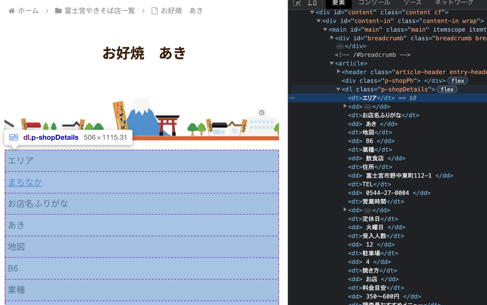

---

```python
for shopinfo in shopinfo_list:
    # URLから店舗情報を取得
    res = requests.get(shopinfo['specurl'])
    soup = BeautifulSoup(res.text, 'html.parser')

    # dl.p-shopDetails > dt/dd構造でdtが項目、ddが値になっている。これを辞書形式にする
    shopspecs = {}
    for dt, dd in zip(
      soup.find('dl', class_='p-shopDetails').find_all('dt'),
      soup.find('dl', class_='p-shopDetails').find_all('dd')
    ):
        # 値に 改行や空白文字があるので取り除く
        shopspecs[dt.text] = replace_str(dd.text)

    # 店舗情報をマップ情報に追加
    shopinfo.update(shopspecs)
```

---

最終的にできるデータ

<!-- TODO: 2023-09-18 生データを使うのがいいか考えたほうがいいかな。 -->

```python
>>> from pprint import pprint
>>> pprint(shopinfo_list)
[{'TEL': '0544-27-0004',
  'specurl': 'https://umya-yakisoba.com/shop/3776/',
  'お店名ふりがな': 'あき',
  'エリア': 'まちなか',
  '住所': '富士宮市野中東町112-1',
  '受入人数': '12',
  '営業時間': '10:00－21:00',
  '地図': 'B6',
  '定休日': '火曜日',
  '店名': 'お好焼 あき',
  '料金目安': '350～600円',
  '業種': '飲食店',
  '焼き方': 'お店',
  '調査員おすすめメニュー': 'キムチとチーズ入り',
  '調査員が見た特徴': 'キャベツとネギが多めに入っている',
  '駐車場': '4'},
...
]
```

---

## 上のコードの注意点

※: この例ではサイトのページネーションに対応していません。
ページネーションについては資料のコードで対応しています。
※: この例を使って、何度もWEBスクレイピングはしないようにしましょう。
randomモジュールやtimeモジュールを組み合わせてランダム時間待機します

```python
import random
from time import sleep

def random_sleep(a: int,b: int) -> None:
    """
    aからbまでのランダムな時間を待つ
    
    """
    time.sleep(random.randint(a,b))

# ランダム時間を待てるようにする
random_sleep(2, 5)
```

---

## データを加工/出力する


マップのもとになるデータを作成します

* **情報を整理して表形式ファイルで書き出す**
* [付録]地理情報を集める

---

## 情報を整理

どのフォーマットで書き出すか

<!-- 挿絵何か入れる。表とかタイルデータとか、点群とか -->

---

よくある地理データ構造

* **CSV（区切り表形式）**
* GeoJSON（WEB APIで広く流通しているJSON形式の地理情報向け）
* KML（XML形式）

（どのような使い方にもよります。他にもあったら教えてください）

---

CSVライブラリを使って書き出せます

```python
import csv

# ※これは実は動きません
with open('mapdata.csv', 'w', newline='') as csvfile:
    writer = csv.DictWriter(csvfile, fieldnames=fieldnames)
    fieldnames = list(shopinfo_list[0].keys())
    writer.writeheader()
    for shopinfo in shopinfo_list:
        writer.writerow(shopinfo)
```

---

各それぞれのお店情報の項目名が違う

```python
>>> shopinfo_list[0].keys()
dict_keys(['specurl', '店名', 'エリア', 'お店名ふりがな', 
'地図', '業種', '住所', 'TEL', '営業時間', '定休日', '受入人数', 
'駐車場', '焼き方', '料金目安', '調査員おすすめメニュー', '調査員が見た特徴'])
>>> shopinfo_list[2].keys()
dict_keys(['specurl', '店名', 'エリア', 'お店名ふりがな', 
'業種', '住所', 'TEL', '営業時間', '定休日', '受入人数', '駐車場', '料金目安'])
>>> 
```

---

→ 全部対応した項目を一度作り、列見出し（ヘッダー）を作る

```python
with open('mapdata.csv', 'w', newline='') as csvfile:
    # フィールド名がまばらだったので、生成する
    # すべてmapinfoからフィールド名を取得してsetで重複を取り除いてリスト化
    fieldnames = list(set().union(*shopinfo_list))

    # 上のコードを丁寧に書くとこうなる
    # all_fieladnames_by_shopinfo = (list(shopinfo.keys()) for shopinfo in shopinfo_list)
    # fieldnames = list(set().union(*all_fieladnames_by_shopinfo))

    writer = csv.DictWriter(csvfile, fidnames=fieldnames)
    writer.writeheader()
    for shopinfo in shopinfo_list:
        writer.writerow(shopinfo)
```

---

出力できたCSVファイル

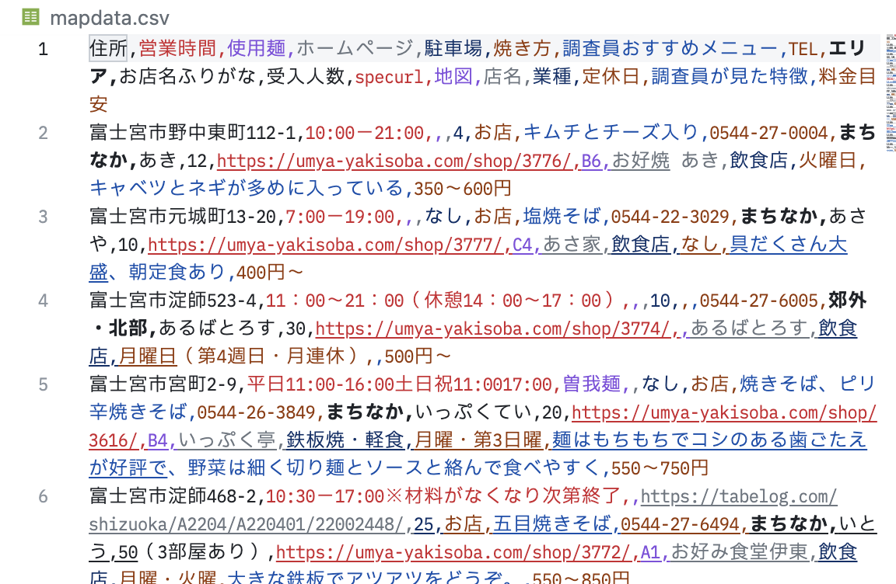

---

## データを使う/活用する

旅行中に使うためのツールとして

* **巨人に乗る: Googleマイマップで使おう**
* [付録]ポータブルに扱う: 印刷をする
* [付録]専用のWEBアプリを作ろう

---

## Googleマイマップで使おう

* Googleが提供するマップのピンや経路をオリジナルで作成できるサービス
* アカウントに紐づいて、スマホ版Googleマップでも表示可能

---

## 扱い方

`https://www.google.com/maps/d/` へアクセスして利用します。

「新しい地図を作成」ボタンを押す

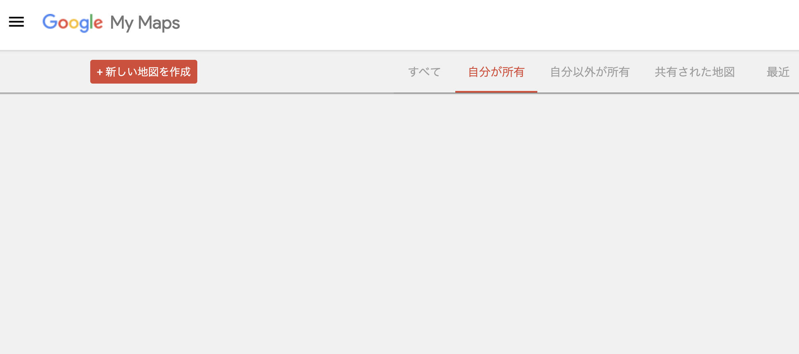

---

新規レイヤーへインポートする

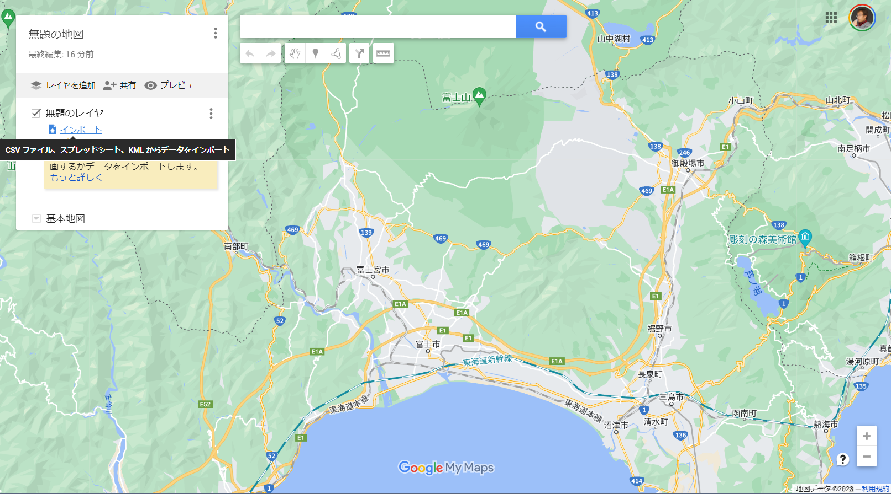

---

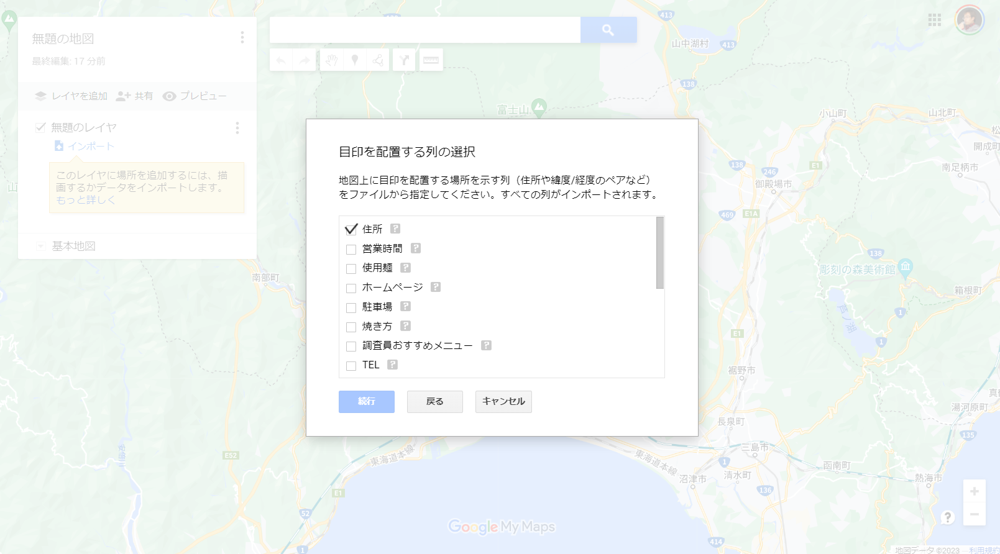 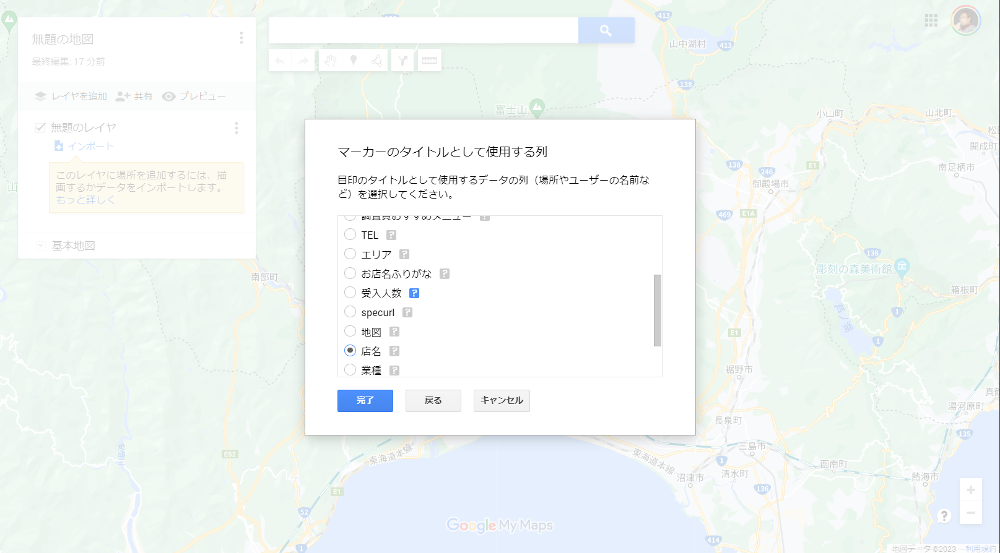

---

マッピングされる

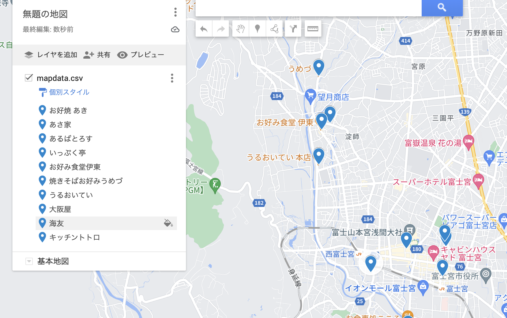

---

やっぱりスマホで使えると便利！ナビも使える🚗

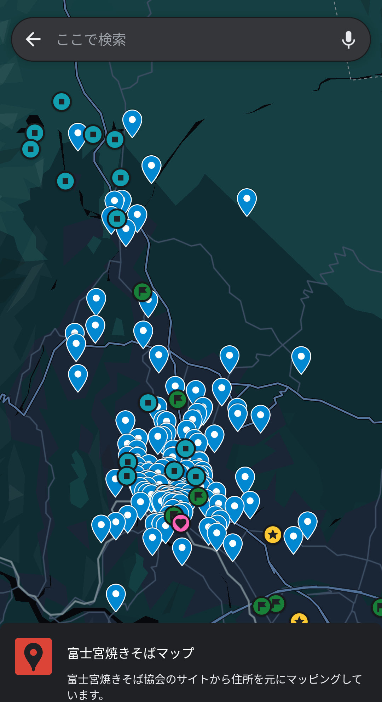

---

## そのほかの選択肢

今回はGoogleマップを上げましたが、推奨しているわけではなくて
データを作るといろんなサービスと連携できることをお伝えしました。

※: オリジナルのマップを作るサービスは他にも多数あります。一例を載せておきます。
※: 良し悪しや無料有料とあるので、使いやすいものを探すと良いと思います

* OpenStreetMap uMap: <https://umap.openstreetmap.fr/ja/>
* proxi: <https://www.proxi.co/>
* [日本向け]国土地理院: <https://maps.gsi.go.jp/>
* etc...

---

## トークのまとめ

---


## 今回のトークで目指すこと

* お店情報をWEBスクレイピング
* 表形式に整形 -> CSVファイル
* Googleマイマップで呼び出す

---

今日学んだことを応用すると

* WEBスクレイピングでデータ収集 -> 世の中のWEBサイトの収集
  **※扱いには気をつけましょう**
  * WEB APIを扱えると収集や操作はもっと楽
* データの書き出し: CSV以外にもjson, xlsx, etc....
* 画像識別で収集
* 他のサービスへの連携:データベースに入れたり

<!-- （今回の知識をベースに何ができるか、各工程で2つぐらいは出しておく） -->

---

どのエンジニアも一番やること

* データを呼ぶ
* データを書き出す

---

* どこから「データを呼ぶ」か
  * データベースから使う
  * データ分析で現実の統計データを使う
  * センサーデータで現実環境を使う
* 「データを書き出す」とできる事
  * ユーザー情報をもとにレコメンデーション
  * データ分析でサービス改善
  * 得られたデータを使って製造工程改善 -> 業務改善

<!-- これができると、仕事も人生まで改善できます！ -->

---

PyCampやプログラミングを学んだ方の一歩先として！

自分が使いたい、利用したいものやことでトライする。

できたらとても楽しいし感動します。おすすめ！

---

**Happy Hacking!!**

**and, Have a nice trip!!**

---

## 付録

今回扱わなかった他の方法については、またどこかで解説できたらと思います

* 画像識別でお店情報を収集する
  * OCR, Googleなど
* 緯度経度を収集
  * 世界: Google?
  * 日本: 東大CSIS
* 印刷物を作る -> テンプレートエンジンで印刷しやすいHTMLを生成
* fletで自分専用のマップアプリを作る

---

## 画像識別

* Google Cloud Vision
  *

---

## 位置情報

* 世界: Google Maps Platform ->
  <https://developers.google.com/maps/documentation/geocoding/overview?hl=ja>
  
* 日本: 東大CSIS -> jageocoder
  <https://github.com/t-sagara/jageocoder>

---

## 印刷用マップを作ってみる

印刷用のHTMLファイルを作って印刷してみる

* Mapboxで概要と詳細の地図を用意
* お店の情報をテーブルで埋め込む
* 印刷用にCSSで調整する

---

## モバイル向けのWEBアプリ

<!-- 実際に作成してみる -->

* staticなページで埋め込んで作ってみる
* <https://flet.dev/docs/guides/python/publishing-static-website/>
