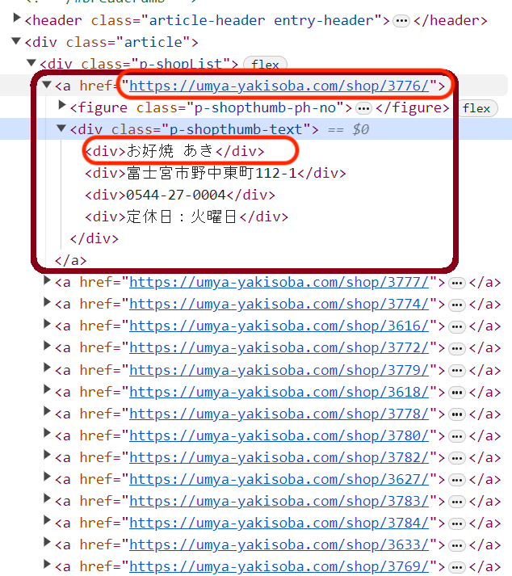
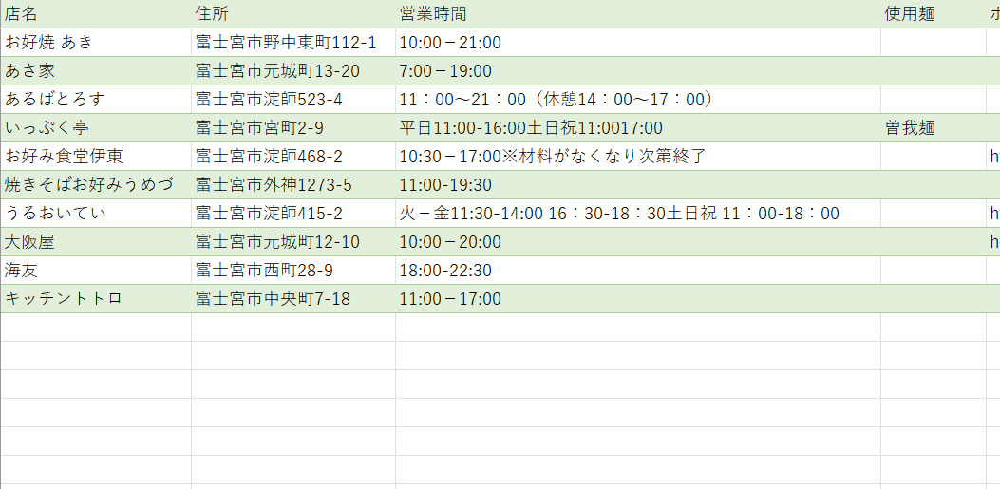

# ご当地グルメマップを作ろう  

# Let's make! Local Food Map

### PyCon APAC 2023 Day2

Hiroshi Sano / 佐野浩士


---

# Agenda

* トークのモチベーション
* 今回のトークでできること

1. お店情報をデータにする: WEBスクレイピング
2. データを整形をする: CSVファイルにする
3. データを使ってみる: Googleマイマップで呼び出す

* まとめ

---

# Today's Document

本日の資料は公開されています

* GitHubリポジトリ: コードとスライド
  <https://github.com/hrsano645/pyconapac2023-local-food-map>

* スライド: Speaker Deck
  <URL載せ替えます>

後日トライしたい方は参考にしてみてください

<!-- _footer: GitHubのStarくれー🦖👍！！ -->

---

# Self Infroduction

Hiroshi Sano(佐野浩士) [@hrs_sano645](https://twitter.com/hrs_sano645)

* 🗺️: Shizuoka, Eastern part🗻
* 🏢: 株式会社佐野設計事務所 CEO
* 👥🤝
  * 🐍: PyCon mini Shizuoka Stuff / Shizuoka.py / Unagi.py / Python駿河
  * CivicTech, Startup Weekend Organizer
* Hobby: Camp🏕️,DIY⚒️,IoT💡

  

---


<!-- 

* 株式会社佐野設計事務所は自動車プレス金型という金型機械を設計する事務所です。
* 3D CADを扱う設計や、金型の中で使う部品や、製品の3Dモデリングを扱っております。
* 設計データはデジタルデータでもありまして、関連した業務の改善をPython＋クラウドサービスを組み合わせて実現しています。
* 製造業とデジタル化で取り組まれていたり、ご興味ある方がいましたら、後ほどのパーティでぜひ意見交換しましょう！

-->

---

# トークのモチベーション

* ご当地グルメを**情報収集してマップを作りましょう！** 食べに行きましょう！
  * ご当地グルメ=B級グルメのこと
* PyCampを終えた人に: **Pythonでデータを集めて作り利用するプロセス**
  を学べます
  * 初学者向けの内容です
  * 話すこと: トークお題をPythonで実装する過程
  * 話さないこと: Pythonの基礎や文法の解説

---

## PyCamp:Python Boot Campとは

* 日本全国で開催されているPythonの初学者向けイベント
* Pythonの基礎を学び、簡単なプログラムを作る
  * 専用テキストを元に講師とTAがサポート


このトークはその続きからトライできるコンテンツを目指して作りました

---

## PyCampの様子

静岡県3回目の様子

  

---

## 今回のお題: 本題のご当地グルメ

---

## 富士宮焼きそば


<!-- _footer: しんかわな, CC BY 3.0 <https://creativecommons.org/licenses/by/3.0>, ウィキメディア・コモンズ経由 -->

---

* 主に静岡の富士宮市周辺で食べられる焼きそば
* 麺は富士宮周辺でしか手に入らない。まさにローカルフード
* B級グルメグランプリ殿堂入り、NYで開催されたコナモングランプリで優勝した

 

<!-- _footer: 地元の人は、多分月に数回は食べてる -->

---

ところで、みなさん

---

もう食べたくなりましたね？🤤

<!-- _footer: このあとはパーティ🎉ですし、お腹空きましたね🤤 -->

---

# 富士宮焼きそばマップを作りましょう

---

# 今回のトークでできること

1. お店情報をデータにする: WEBスクレイピング
2. データを整形をする: CSVファイルにする
3. データを使ってみる: Googleマイマップで呼び出す

---

## 今回のトークでできること


1. お店情報をデータにする: WEBスクレイピング
2. データを整形をする: CSVファイルにする
3. データを使ってみる: Googleマイマップ

<p align="center">⬇️</p>

1. データを読む/取り込む
2. データを加工/出力する
3. データを使う/活用する

---

## 1. データを読む/取得する


* 🔍**WEBスクレイピングで収集する**
* [付録]🖼️画像識別で加工を試みる

機械可読性はどちらも微妙
WEBスクレイピングはまだやりやすい

---

## ご当地グルメの情報はどこにあるか

* 地域の情報を収集
* **その情報は機械可読ができるか？**
  * 大体が紙ベースが多い📃🐐（画像識別の手段は使える）

観光情報を探ってみると...

* 市役所で紹介されていたり
* 観光協会で紹介されていたり
* ご当地グルメの公式サイト（よく〇〇学会とも言われる）

<!-- _footer: グルメ情報サイトを見たらそこで試合終了ですよ -->

---

今回は、富士宮焼きそば学会の公式サイトを例にしています。

<https://umya-yakisoba.com/shop/>

<!-- _footer: 富士宮焼きそば学会の公式サイトを見せます -->

---

## 利用するライブラリ

* requests: HTTPアクセス→情報取得（今回はHTML）
* BeautifulSoup4: HTML（マークアップ言語）解析と抽出

```bash
pip install requests
pip install beautifulesoup4
```

※:スライドのコードは説明向けです。そのままだと動かないこともあります
資料のリポジトリから動作するスクリプトをDL可能です。

---

この構造からBeautifulSoup4を使って必要な情報を取り出します。


---


構造の中にあるタグから必要な情報を取得する

```python
import requests
from bs4 import BeautifulSoup

url = "https://umya-yakisoba.com/shop/"
shopinfo_list = []
res = requests.get(url)
soup = BeautifulSoup(res.text, 'html.parser')

# ここではdiv.p-shopList > a にURLがある
# その中にお店情報がまとまっているので、aタグから取り出す
shopinfo_tags = soup.find(
  'div', class_='p-shopList'
  ).find_all("a")
```

---



aタグの中にあるタグから必要な情報を取得する

```python
for shopinfo_tag in shopinfo_tags:
    shopdata = {}
    # divは上から店名、住所、電話番号、定休日。
    # ここではurlと店名だけまとめたリストを作る
    shopdata['specurl'] = shopinfo_tag.get('href')
    shopdata['店名'] = replace_text(
      shopinfo_tag.find_all("div")[1].text
    )
    
    shopinfo_list.append(shopdata)
```

※ replace_text関数:
店名に出てくる空白文字を置き換える独自関数
（後述します）

---

お店の詳細URL, 店名が集まりました🎉

```python
>>> shopinfo_list
[{'specurl': 'https://umya-yakisoba.com/shop/3776/', '店名': 'お好焼 あき'},
 {'specurl': 'https://umya-yakisoba.com/shop/3777/', '店名': 'あさ家'},
 {'specurl': 'https://umya-yakisoba.com/shop/3774/', '店名': 'あるばとろす'},
 {'specurl': 'https://umya-yakisoba.com/shop/3616/', '店名': 'いっぷく亭'},
...
]
```

---

収集した詳細URLのリストを使って、お店情報収集


`dt`と`dd`タグは記述リスト、説明リストと呼ばれるHTMLタグ

---


```python
for shopinfo in shopinfo_list:
    # URLから店舗情報を取得
    res = requests.get(shopinfo['specurl'])
    soup = BeautifulSoup(res.text, 'html.parser')

    # dl.p-shopDetails > dt/dd構造でdtが項目、
    # ddが値になっている。これを辞書形式にする
    shopspecs = {}
    for dt, dd in zip(
      soup.find('dl', class_='p-shopDetails').find_all('dt'),
      soup.find('dl', class_='p-shopDetails').find_all('dd')
    ):
        # 値に 改行や空白文字があるので取り除く
        shopspecs[dt.text] = replace_text(dd.text)

    # 店舗情報をマップ情報に追加
    shopinfo.update(shopspecs)
    # INFO:ここにランダム待機時間があるとよさそう
```

---

最終的にできるデータ🎉

```python
>>> from pprint import pprint
>>> pprint(shopinfo_list)
[{'TEL': '0544-27-0004',
  'specurl': 'https://umya-yakisoba.com/shop/3776/',
  'お店名ふりがな': 'あき',
  'エリア': 'まちなか',
  '住所': '富士宮市野中東町112-1',
  '受入人数': '12',
  '営業時間': '10:00－21:00',
  '地図': 'B6',
  '定休日': '火曜日',
  '店名': 'お好焼 あき',
  '料金目安': '350～600円',
  '業種': '飲食店',
  '焼き方': 'お店',
  '調査員おすすめメニュー': 'キムチとチーズ入り',
  '調査員が見た特徴': 'キャベツとネギが多めに入っている',
  '駐車場': '4'},
  # 以下お店情報の辞書が続いて入る
  # ...
]
```

---

## 上記コードの注意点

※: サイト上に見えない文字があることがあります → 文字列置換をしましょう

※: ⚠️WEBスクレイピングは注意が必要です
randomモジュールやtimeモジュールを組み合わせてランダム時間待機します
ポリシーを守りましょう

※: この例ではサイトのページネーションに対応していません
ページネーションについては資料のコードで対応しています

---

## 文字列の置き換え

見えない空白や改行などを取り除くと綺麗に使えます。

```python
def replace_text(text: str) -> str:
  
    replace_text_map = {
        # 置き換え対象文字列:置き換え先の文字列
        "\u3000": " ",
        "\n":"", 
    }
    replaced_text = text
    for src, dst in replace_text_map.items():
        replaced_text = replaced_text.replace(src, dst)
    return replaced_text

# 例:
print(replace_text("お好焼\u3000さの"))
# お好焼 さの
```

---

## ⚠️WEBスクレイピングの注意点⚠️

**※スクレイピング対象のサイトへ多数のアクセスはしないように注意**

* よくあるトラブル
  * ループ構造が深くてアクセス回数が膨れる
  * エラーの時にリトライしすぎて
* 試すとき**少し時間を置きながらアクセス**
  * ランダム時間置いてみる
  * 回数リミットをつけて待つ
* **サイトポリシーがあればそれに従う**
  * 規約に掲載されている
  * クローラー向けのポリシー: robot.txtを見る

<!-- https://umya-yakisoba.com/robots.txt -->
---

ランダム時間待機できる関数の例

```python
import random
from time import sleep

def random_sleep(a: int,b: int) -> None:
    """
    aからbまでのランダムな秒数を待つ
    """
    time.sleep(random.randint(a,b))

# 2~5秒の間でランダムに待つ
random_sleep(2, 5)
```

---

## 2.データを加工/出力する


マップのもとになるデータを作成します

* **💾情報を整理して表形式ファイルで書き出す**
* [付録]👣地理情報を集める

---

## 情報を整理

どのフォーマットで書き出すか？

よくある地理データ構造、フォーマット形式

* **CSV（区切り表形式、汎用性高）**
* GeoJSON（WEB APIで広く流通しているJSON形式の地理情報向け）
* KML（XML形式）

<!-- _footer: ※どのような使い方にもよります。他にもあったら教えてください -->

---

CSVライブラリを使って書き出せます

`csv.DictWriter`を使うと辞書のキーを使って列見出しを用意できる

```python
with open('mapdata.csv', 'w', newline='') as csvfile:
    # お店の詳細情報の各項目:辞書のキー が部分的にあったりなかったりしたので
    # 全ての辞書のキーから全ての項目をカバーしたリストを生成する
    fieldnames = list(set().union(*shopinfo_list)

    writer = csv.DictWriter(csvfile, fidnames=fieldnames)
    writer.writeheader()
    for shopinfo in shopinfo_list:
        writer.writerow(shopinfo)
```

---

お店ごとに詳細情報の項目数が違う

```python
>>> shopinfo_list[0].keys()
dict_keys(['TEL', 'specurl', 'お店名ふりがな', 'エリア', '住所', '受入人数', '営業時間', 
'地図', '定休日', '店名', '料金目安', '業種', '焼き方', 
'調査員おすすめメニュー', '調査員が見た特徴', '駐車場'])
>>> shopinfo_list[1].keys()
dict_keys(['TEL', 'specurl', 'お店名ふりがな', 'エリア', '住所', '受入人数', '営業時間', 
'地図', '定休日', '店名', '料金目安', '業種', '焼き方'])
```

それぞれの項目をすべて合わせたリストを作る

```python
>>> print(list(set().union(*shopinfo_list)))
['エリア', '駐車場', '焼き方', '受入人数', 'specurl', 'TEL', '店名', '定休日', '業種', 
'調査員が見た特徴', '住所', '営業時間', 'お店名ふりがな', '地図', '料金目安', '調査員おすすめメニュー']
```

---

出力できたCSVファイル🎉

 

---

## 3. データを使う/活用する


旅行中に使うためのツールとして

* **巨人の肩に乗る:
🗺️Googleマイマップで使おう**
* [付録]🖨️ポータブルに扱う: 印刷をする
* [付録]🖥️専用のWEBアプリを作ろう

Googleマイマップとは

* オリジナルマップを作成できる
* スマホ版Googleマップでも表示可能

---

## 扱い方

`https://www.google.com/maps/d/` へアクセスして利用します。

「新しい地図を作成」ボタンを押す


---

新規レイヤーへCSVファイルをインポートします


---

マップへのポイントは住所を使います


---

ポイントした部分への簡易説明（マーカー）を入れる。

今回は店名にしました。


---

マッピングされました🎉


---

スマホで見ることもできます！📱


---

## そのほか選択肢

今回はGoogleマイマップを利用しましたが、推奨しているわけではなくて
データを作るといろんなサービスと連携できることをお伝えしました。

※: オリジナルのマップを作るサービスは他にも多数あります。一例を載せます
※: それぞれ特徴や無料有料とあるので、使いやすいものを探すと良いと思います

* OpenStreetMap uMap: <https://umap.openstreetmap.fr/ja/>
* proxi: <https://www.proxi.co/>
* [日本向け]国土地理院: <https://maps.gsi.go.jp/>
* etc...

---

# トークのまとめ

---


## 今回のトークでできること

1. お店情報をデータにする: WEBスクレイピング
2. データを整形をする: CSVファイルにする
3. データを使ってみる: Googleマイマップ

<p align="center">⬇️</p>

1. データを読む/取り込む
2. データを加工/出力する
3. データを使う/活用する

---

<!-- # TODO:2023-10-20 
* ここのどこへ -> どこに に変更する
* 上のトークでできることの下の列は全部この言葉に置き換える
* フローの挿絵を少し変える。フリー素材で人が動いているものを探す
 -->

プログラミングでもっとも行われる行為

* **どこから** データを取り出すか
* **どんな** データを作るか
* **どこへ** データを渡すか

---

* **どこから** データを取り出すか
  * データベースから取り出す
  * 現実の統計データを使う
  * センサーデータで現実環境を扱う
* **どんな** データを作るか
  * データを加工して新しいデータを作る
  * データを整形する
* **どこへ** データを渡すか
  * データの可視化をして分析
  * データを使って業務工程改善
  * データを使ってAIで予測

---

* **どこから** データを取り出すか
  * データベースから取り出す ➡️ データベース接続、API
  * 現実の統計データを使う ➡️ データセット、オープンデータ
  * センサーデータで現実環境を扱う ➡️ ハードウェア操作
* **どんな** データを作るか
  * データを加工して新しいデータを作る ➡️ 前処理、後処理
  * データを整形する ➡️ ファイル形式、データ構造
* **どこへ** データを渡すか
  * データの可視化をして分析 ➡️ グラフ、ダッシュボード
  * データを使って業務工程改善 ➡️ オートメーション、システム連携
  * データを使ってAIで予測 ➡️ 機械学習、ディープラーニング

<!-- _footer: データの流れを意識すると、作りたいプログラムの流れも理解しやすい -->

---

# 最後に伝えたいこと

PyCampやPythonの基礎を学んだ方の一歩先として！

自分が使いたい、利用したい、ものやことでトライしましょう

それができれば、とても楽しいし感動します。オススメです😆

---

**Happy Hacking!!**

**and, Have a nice trip!!**

---

# 付録

---

今回扱わなかった他の方法については、またどこかで解説できたらと思います

* WEBスクレイピングしづらいサイトもカバーする
  * selenium + headless chrome
* 画像識別でお店情報を収集する
  * OCR, Googleなど
* 緯度経度を収集
  * 世界: Google?
  * 日本: 東大CSIS
* 印刷物を作る -> テンプレートエンジンで印刷しやすいHTMLを生成
* fletで自分専用のマップアプリを作る

---

## WEBスクレイピング: Seleniumの例

* 動的な（javascriptなど利用した）サイトはrequestsで対応が難しいことがあります
* 本物のブラウザ + ブラウザ自動操作ツール(selenium)を使った例も載せておきます

-> url

---

## 画像識別

結構難しい分野（ちょっと自信ない）

* Google Cloud Vision
  * -> url

---

## 位置情報

* 世界: Google Maps Platform ->
  <https://developers.google.com/maps/documentation/geocoding/overview?hl=ja>
  * -> url

* 日本: 東大CSIS -> jageocoder
  <https://github.com/t-sagara/jageocoder>
  * 無料で利用できる（リクエスト数は少なめがよし
  * -> url

---

## 印刷用マップを作ってみる

印刷用のHTMLファイルを作って印刷してみる

* Mapboxで概要と詳細の地図を用意
* お店の情報をテーブルで埋め込む
* 印刷用にCSSで調整する

-> url

---

## モバイル向けのWEBアプリ

<!-- 実際に作成してみる -->

実験的な扱いです。うまく動かなければ...

* fletを使って作ってみました
* staticなページでWASMとして埋め込んで作ってみる
  * <https://flet.dev/docs/guides/python/publishing-static-website/>
* ※サイト自体の公開はしません

-> url
